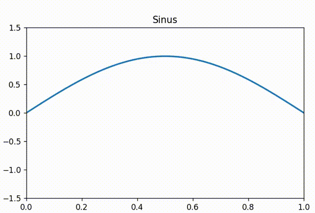
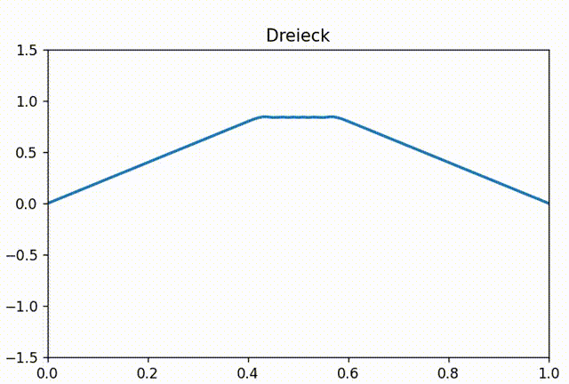
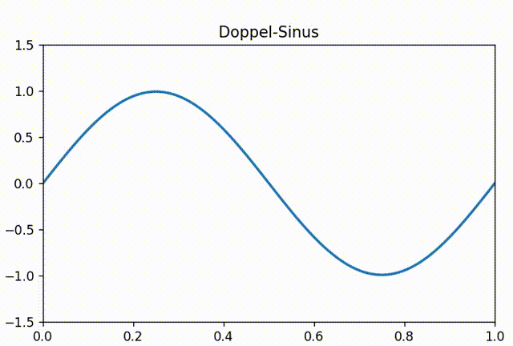
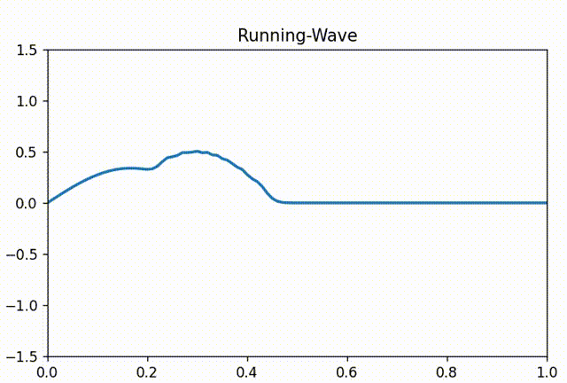
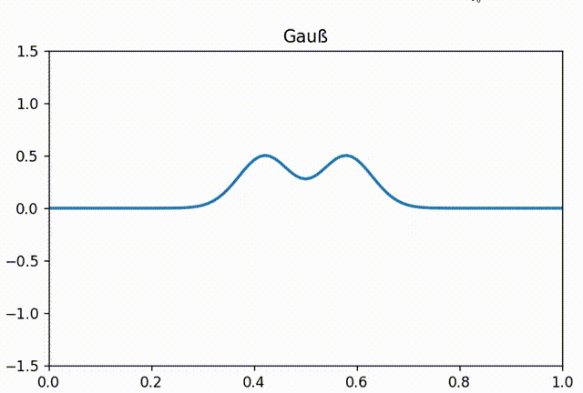

# FDM - Finite Difference Method (Wave Equation)

[Finite Difference Method](https://en.wikipedia.org/wiki/Finite_difference_method)(FDM) solver for the one-dimensional wave equation modeling vibrating string dynamics.  
This Python-based simulation provides interactive visualization of string oscillations with multiple selectable initial conditions using Matplotlib.

---

## Abstract

This project numerically solves the classical one-dimensional wave equation using the finite difference method (FDM).  
The wave equation governs the transverse vibrations of a stretched string fixed at both ends.  
Various initial displacement and velocity profiles can be selected to observe different modes of string oscillations.  

The simulation demonstrates wave propagation, reflection at fixed boundaries, and interference patterns inherent to the wave equation.

---

## Methodology

🔁 **Wave equation:**

$$
\frac{\partial^2 u}{\partial t^2} = c^2 \frac{\partial^2 u}{\partial x^2}
$$

**Conditions:**
String length:

$$
L = 1
$$

Wave propagation speed:

$$
c = 1
$$

Fixed ends (boundary conditions):

$$
u(0, t) = u(L, t) = 0
$$

Initial displacement:

$$
u(x, 0) = \sin(\pi x)
$$

Initial velocity:

$$
\frac{\partial u}{\partial t}(x, 0) = 0
$$

---

🧮 **Finite difference method**
We approximate the second derivatives in time and space.

**Difference scheme:**

$$
u_i^{n+1} = 2 u_i^n - u_i^{n-1} + c^2 \left(\frac{\Delta t}{\Delta x}\right)^2 \left(u_{i+1}^n - 2 u_i^n + u_{i-1}^n \right)
$$


---

## Features

- Multiple selectable initial conditions including sinusoidal, triangular, Gaussian, and localized velocity "hit" profiles.  
- Real-time interactive visualization with Matplotlib animation and GUI buttons to switch initial conditions.  
- Demonstrates fundamental wave phenomena: propagation, reflection, superposition.

---

## Requirements

- Python 3.x  
- numpy  
- matplotlib

Install dependencies via pip if needed:

```bash
pip install numpy matplotlib
````

---

## Usage

Run the simulation script:

```bash
python fdm.py
```

An interactive window will open showing the vibrating string.
Use the buttons to change initial displacement and velocity conditions dynamically.








